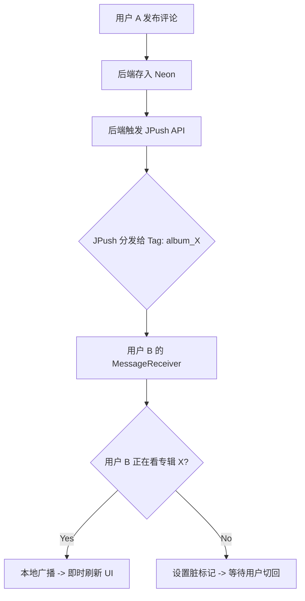

# 音乐专辑社交评论功能架构与实现方案

## 1. 架构概述

本项目（MoodyMusic）针对“音乐专辑下发帖与评论”功能的社交需求，摒弃传统的 WebSocket 长连接方案，采用**“静默透传推送驱动 + HTTP REST API 降级拉取”**的架构模式。

### 1.1 核心设计理念
- **无流氓保活**：极度尊重用户设备资源，放弃强制后台驻留。
- **降本增效**：后端复用现成的 Neon (Serverless PostgreSQL)，客户端完全复用现有的 Retrofit 网络层，实现零新增依赖门槛。
- **优雅的生命周期**：
  - **听歌后台态**：音乐 Service 保证进程存活，接收到透传消息仅置脏标记（Dirty Flag），不做网络请求，不抢占带宽与 CPU。
  - **前台交互态**：根据推送或下拉动作静默获取数据，丝滑更新 UI。

---

## 2. 数据库设计 (基于 Neon/PostgreSQL)

为了支持“专辑下的帖子及回复”，我们需要设计一个树形/层级结构的评论表。

### 2.1 表结构 `album_comments`

| 字段名 | 类型 | 说明 | 约束/默认值 |
| :--- | :--- | :--- | :--- |
| `id` | `UUID` / `BIGSERIAL` | 评论唯一标识 | PRIMARY KEY |
| `album_id` | `VARCHAR` | 关联的音乐专辑 ID | NOT NULL, INDEX |
| `user_id` | `VARCHAR` | 发布该评论的用户 ID | NOT NULL |
| `content` | `TEXT` | 评论的正文内容 | NOT NULL |
| `parent_id` | `UUID` / `BIGINT` | 父评论 ID（如果是主贴则为 NULL）| NULLABLE |
| `root_id` | `UUID` / `BIGINT` | 根帖子 ID（用于快速查出一个帖子下的所有回复）| NULLABLE, INDEX |
| `created_at` | `TIMESTAMP` | 创建时间 | DEFAULT NOW() |
| `updated_at` | `TIMESTAMP` | 更新时间 | DEFAULT NOW() |

> **设计建议**
> 为了查询性能，对 `album_id` 和 `root_id` 建立索引。在 Neon 的 Serverless 架构下，普通的 B-Tree 索引足以应对百万级别的常规检索。

---

## 3. 后端接口设计 (RESTful API)

后端（假设为 Node.js 或 Go 服务）需要提供以下基础 HTTP 接口供安卓端 Retrofit 调用：

### 3.1 发布主贴/评论
- **Endpoint**: `POST /api/v1/albums/{album_id}/comments`
- **Authentication**: `Authorization: Bearer <JWT>`
- **Request Body**:
  ```json
  {
    "content": "这张专辑的 Bass 简直绝了！",
    "parent_id": null, 
    "root_id": null
  }
  ```
- **业务逻辑**：
  1. **Neon 存盘**: 插入数据到 `album_comments` 表。
  2. **Tag 构建**: 生成推送标签 `album_{album_id}`。
  3. **异步推送**: 调用 JPush API 下发 `refresh_comments` 透传信号。

### 3.2 分页拉取专辑评论 (Feed)
- **Endpoint**: `GET /api/v1/albums/{album_id}/comments`
- **Query Params**:
  - `limit`: 每页数量 (默认 20)
  - `offset`: 偏移量
- **Response**: 包含用户信息（昵称、头像）及主贴详情的列表。

---

## 4. 实时同步机制与状态管理

### 4.1 客户端标签管理 (JPush Tags)
为了实现“精准刷新”，客户端在切换专辑时执行以下逻辑：
1. **进入详情 (onStart/onResume)**: 调用 `JPushInterface.setTags` 绑定 `album_{current_id}`。
2. **退出详情 (onStop/onPause)**: 调用 `JPushInterface.setTags` 清除相关标签。
3. **全局标记**: `AppFlags.visibleAlbumId` 记录当前可见专辑，用于推送接收时的二次校验。

### 4.2 推送信号处理策略 (Signal-Only)
我们采用 **“信号优于数据 (Signal over Data)”** 的策略：
- **推送 Payload**: 仅包含 `{"action": "FETCH_NEW", "album_id": "xxx"}`。
- **优点**: 避免推送 Payload 大小限制（4K），且通过重新请求接口确保了数据的最终一致性（防止推送内容与数据库状态不一）。

---

## 5. 安卓端架构集成规范

### 5.1 从 Activity 到 Fragment 的迁移
功能已从独立的 `AlbumDetailActivity` 迁移至 `LibraryFragment`。
- **逻辑容器**: `LibraryFragment` 持有 `AlbumSocialViewModel` (ActivityScope)。
- **实时刷新**: 通过 `LocalBroadcastManager` 接收来自 `JPushReceiver` 的本地广播，动态触发 `fetchSocialContent()`。
- **UI 更新**: 使用 `BaseRecyclerViewAdapterHelper` 实现评论列表的增量更新。

### 5.2 脏标记 (Dirty Flag) 实现
当 App 处于后台或非社交页面时：
1. 收到推送，设置 `AppFlags.hasNewAlbumComments = true`（注意：已根据最新代码改为该命名）。
2. 当用户切换回 `LibraryFragment` 时，在 `onResume` 中检查标记并按需静默刷新。

---

## 6. 核心思想总结

### 6.1 精准投送
只有正在查看同一张专辑的用户才会收到刷新信号。这实现了完美的逻辑隔离，极大地节省了系统功耗。

### 6.2 状态机流转图 (Updated)



---

> **结语**
> 本系统的社交功能虽然隐藏在“冰山之下”（滑动到底部可见），但其背后的分布式同步系统却具备了工业级的响应速度与稳定性。

